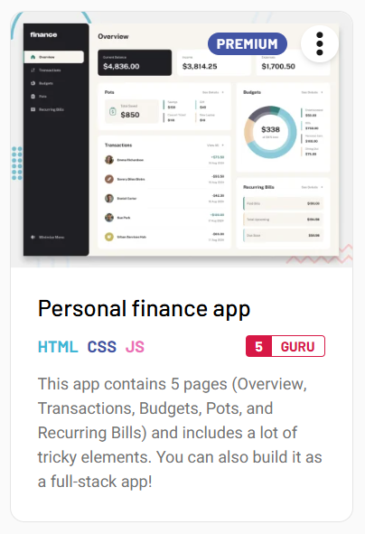

# PERSONAL FINANCE APP

This is a personal finance tracking app. Users can create budgets, pots to better track their expenditure. 
They can see overview of their transactions and recurring bills.
This project is based on coding challenge from website https://www.frontendmentor.io/home that provides designs in figma to practice programming skills.
It is a fullstack app created with tech stack:
   
   - BE: NodeJs, Typescript, Postgres, Docker, Nginx
   - FE: Nuxt, Vue 3
        

### Prerequisites
Before you begin, make sure you have met the following requirements:

- installed **code editor** -> [Download VSCode]https://code.visualstudio.com/
- installed **git** (for cloning the repository) -> [Download Git]https://git-scm.com/
- installed **node** (v22 or higher) -> [Download Node]https://nodejs.org/en
- installed **npm or nvm** (v9 or higher) -> [Download NPM or NVM]https://www.npmjs.com/ https://github.com/nvm-sh/nvm
- installed **docker** -> [Download Docker]https://www.docker.com/

- `git clone git@github.com:bujdoluk/finance-app.git`

### Environment variables

- Create .env file in ./backend path and add your configuration
- DONT FORGET TO ADD YOUR .env FILE INTO .gitignore !!!

### Install dependencies

- `cd backend`
- `npm i`
- `..cd`
- `frontend`
- `npm i`

### (Option 1) RUN app via npm script

- `npm run dev`

### (Option 2) RUN app via docker

- `docker_compose up --build -d`

### CREATE migrations and seeds

- `npm run migrate:create create_users_table`
- `npm run migrate:create seeds_users_table`

### RUN migrations
All docker containers must be up and running before running migrations

- `docker exec -it api npm run migrate:up`
- `docker exec -it api npm run migrate:down`
- `docker exec -it api npm run migrate:redo`

### RUN tests
